# 🚀 Algorithmic Trading Portfolio Management

[](https://www.python.org/downloads/)
[](LICENSE)
[](https://github.com/psf/black)

> A sophisticated algorithmic trading system implementing both buy-and-hold and short-term trading strategies using modern portfolio theory and quantitative analysis.

## 📋 Table of Contents

- [🎯 Project Overview](#-project-overview)
- [✨ Key Features](#-key-features)
- [🏗️ System Architecture](#-system-architecture)
- [🚀 Quick Start](#-quick-start)
- [📊 Strategy Details](#-strategy-details)
- [🔧 Configuration](#-configuration)
- [📁 Project Structure](#-project-structure)
- [📊 Dashboard](#-dashboard)
- [🔄 Automated Pipelines](#-automated-pipelines)
- [🙏 Acknowledgments](#-acknowledgments)
- [📄 License](#-license)

## 🎯 Project Overview

This project implements a comprehensive algorithmic trading system that combines:
- **Long-term investment strategies** using Modern Portfolio Theory (Markowitz optimization)
- **Short-term trading strategies** with technical indicators and sentiment analysis
- **Risk management** through systematic backtesting and performance evaluation
- **Automated execution** via scheduled pipelines and monitoring

## ✨ Key Features

### 📊 **Data Collection & Processing**
- **Multi-source data aggregation**: Yahoo Finance, OpenBB, Financial Modeling Prep API
- **Real-time & historical data**: Stock prices, fundamentals, economic indicators
- **News sentiment analysis**: TextBlob-based sentiment scoring
- **Efficient data storage**: Polars & DuckDB for high-performance analytics

### 🎯 **Portfolio Strategies**

#### Long-term Strategy (Buy & Hold)
- **Markowitz Mean-Variance Optimization**
- **Fundamental screening criteria**:
  - Market Cap: $50B - $500B
  - P/E Ratio: < 30
  - P/S Ratio: ≤ 5
  - P/B Ratio: 0 < x ≤ 10
  - Operating Margin: > 20%
- **Sector diversification constraints**
- **Monthly rebalancing**

#### Short-term Strategy
- **Technical indicator integration**
- **Sentiment-driven signals**
- **Weekly rebalancing**
- **Risk-adjusted position sizing**

### 📈 **Advanced Analytics**
- **QuantStats integration** for comprehensive performance reporting
- **Statistical significance testing**
- **Monte Carlo simulations**
- **Drawdown analysis and risk metrics**

## 🎨 System Architecture

```mermaid
flowchart TB
    %% Data Sources
    DS["📊 Equity Portfolio<br/>(S&P 500 Stocks)"]
    
    %% Strategy Split
    DS -->|70% Capital Allocation| LTS["📈 Long-Term Portfolio<br/>(Quartely Rebalancing)"]
    DS -->|25% Capital Allocation| STS["⚡ Short-Term Portfolio<br/>(Weekly Rebalancing)"]
    DS -->|5% Capital Allocation| OS["🎲 Options Strategy<br/>(Hedging & Income)"]
    
    %% Long-Term Strategy Branch
    LTS --> FS[🔍 Fundamental Screening<br/>Market Cap: $50B-$500B<br/>P/E < 30, P/S ≤ 5, P/B: 0-10<br/>Operating Margin >= 20%]
    FS --> HD["💹 Historical Price Data<br/>(Anualized Returns)"]
    HD --> CM["⚙️ Covariance Matrix<br/>(Assets STDev Correlation)"]
    CM --> MPT["🎯 Markowitz Model<br/>(Sharpe Ratio Optimization)"<br/>Min 5 assets<br/>Max 30% Asset Allocation]
    MPT --> LTP[🏆 Long-Term Portfolio<br/>Optimized Weights]
    
    %% Short-Term Strategy Branch
    STS --> ND["📰 News Data Sentiment<br/>(TextBlob)"]
    ND --> TI["📈 Technical Indicators<br/>(SMA, EMA, RSI, BBands)"]
    TI --> SG["⚖️ Parameter Selection<br/>(Max Sharpe/Sortino Ratio)"]
    SG --> PS2["⚡ Signal Generation<br/>(Buy | Sell | Hold)"]
    PS2 --> STP[🎯 Short-Term Portfolio<br/>Active Trading Positions]
    
    %% Options Strategy Branch
    OS --> OA["🔍 Options Analysis<br/>(IV, Greeks, Volume)"]
    OA --> OH["🛡️ Hedging Strategies<br/>(Protective Puts, Collars)"]
    OA --> OI["💰 Income Strategies<br/>(Covered Calls, Cash Secured Puts)"]
    OH --> OP[📊 Options Portfolio<br/>Risk Mitigation Positions]
    OI --> OP
    
    %% Portfolio Combination
    LTP --> CP["🔄 Master Strategy<br/>(Combined Portfolios)"]
    STP --> CP
    OP --> CP
    
    %% Backtesting & Analysis
    CP --> BE["📈 Bechmark Selection<br/>(Regression Analysis)"]
    BE --> PR["📋 Backtesting<br/>(Historical Performance)"]

    %% Automation
    PR --> AP["🤖 Automated Pipelines<br/>(Weekly | Quarterly Execution)"]
    OP --> RM["⚠️ Risk Management<br/>(Performance Tracking)"]
    CP --> RM
    
    
    %% Improved Styling with Better Contrast
    style DS fill:#e3f2fd,stroke:#1976d2,stroke-width:2px,color:#000000
    
    %% Long-term styling with dark text
    style LTS fill:#e8f5e8,stroke:#4caf50,stroke-width:2px,color:#000000
    style FS fill:#fff8e1,stroke:#ff9800,stroke-width:2px,color:#000000
    style HD fill:#e8f5e8,stroke:#4caf50,stroke-width:2px,color:#000000
    style CM fill:#f3e5f5,stroke:#7b1fa2,stroke-width:2px,color:#000000
    style MPT fill:#e1f5fe,stroke:#0288d1,stroke-width:3px,color:#000000
    style LTP fill:#c8e6c9,stroke:#388e3c,stroke-width:3px,color:#000000
    
    %% Short-term styling with white text on dark backgrounds
    style STS fill:#ffcdd2,stroke:#d32f2f,stroke-width:2px,color:#000000
    style ND fill:#fce4ec,stroke:#c2185b,stroke-width:2px,color:#000000
    style TI fill:#ffcdd2,stroke:#d32f2f,stroke-width:2px,color:#000000
    style SG fill:#f3e5f5,stroke:#9c27b0,stroke-width:2px,color:#000000
    style PS2 fill:#ffcdd2,stroke:#d32f2f,stroke-width:2px,color:#000000
    style STP fill:#ef9a9a,stroke:#c62828,stroke-width:3px,color:#000000
    
    %% Options strategy styling
    style OS fill:#fff3e0,stroke:#f57c00,stroke-width:2px,color:#000000
    style OA fill:#faf2ff,stroke:#6a1b9a,stroke-width:2px,color:#000000
    style OH fill:#e8f5e8,stroke:#2e7d32,stroke-width:2px,color:#000000
    style OI fill:#fff8e1,stroke:#ef6c00,stroke-width:2px,color:#000000
    style OP fill:#ffe0b2,stroke:#e65100,stroke-width:3px,color:#000000
    
    %% Combined flow styling
    style CP fill:#b3e5fc,stroke:#0288d1,stroke-width:3px,color:#000000
    style BE fill:#c8e6c9,stroke:#388e3c,stroke-width:2px,color:#000000
    style PR fill:#f8bbd9,stroke:#c2185b,stroke-width:3px,color:#000000
    style AP fill:#e0e0e0,stroke:#424242,stroke-width:2px,color:#000000
    style RM fill:#fff9c4,stroke:#f57f17,stroke-width:2px,color:#000000
    
    %% Subgraph for better organization
    subgraph LongFlow[" "]
        direction TB
        FS
        HD
        CM
        MPT
        LTP
    end
    
    subgraph ShortFlow[" "]
        direction TB
        ND
        TI
        SG
        PS2
        STP
    end
    
    subgraph OptionsFlow[" "]
        direction TB
        OA
        OH
        OI
        OP
    end
    
    subgraph Analytics[" "]
        direction TB
        BE
        PR
        AP
    end
    
    %% Subgraph styling with better visibility
    style LongFlow fill:#f1f8e9,stroke:#4caf50,stroke-width:2px,stroke-dasharray: 5 5
    style ShortFlow fill:#fce4ec,stroke:#e91e63,stroke-width:2px,stroke-dasharray: 5 5
    style OptionsFlow fill:#fff8e1,stroke:#ff9800,stroke-width:2px,stroke-dasharray: 5 5
    style Analytics fill:#fff8e1,stroke:#ff9800,stroke-width:2px,stroke-dasharray: 5 5
```



## 🚀 Quick Start

### Prerequisites
- Python 3.8+
- API Keys (optional but recommended):
  - Financial Modeling Prep API
  - OpenBB Terminal

### Installation

```bash
# Clone the repository
git clone https://github.com/renan-peres/mfin-algo-trading-team.git
cd mfin-algo-trading-team

# Install Astral UV (for reproducible venvs)
curl -LsSf https://astral.sh/uv/install.sh | env INSTALLER_NO_MODIFY_PATH=1 sh

# Create virtual environment
uv venv                                 # or: python3 -m venv .venv
source .venv/bin/activate               # or: source venv/bin/activate 

# Install dependencies
uv pip install -r requirements.txt

# Set up environment variables (optional)
cp .env.example .env
# Edit .env with your API keys
```

### Quick Run

```bash
# Run the complete pipeline
bash pipelines/weekly_pipeline.sh

# Or run individual components
jupyter notebook notebooks/01_data_collection.ipynb
```

## 📊 Strategy Details

### **Long-Term Portfolio Construction (85% Capital Allocation)**

1. **Data Collection**: Scrape S&P 500 constituents and fundamental data
2. **Screening**: Apply fundamental filters to identify quality stocks
3. **Optimization**: Use Markowitz optimization with constraints:
   - Minimum 5 assets, maximum 30% allocation per asset
   - Maximum 2 assets per sector
   - Minimum 5% allocation per selected asset
4. **Backtesting**: Monthly rebalancing with transaction cost modeling


### **Sort-Term Portfolio Construction (15% Capital Allocation)**


## 🔧 Configuration

### Environment Variables

```bash
# API Configuration
FMP_API_KEY=your_fmp_api_key
OPENBB_API_KEY=your_openbb_key

# Portfolio Parameters
MIN_ASSETS=5
MAX_ALLOCATION=0.30
MIN_ALLOCATION=0.05
REBALANCING_FREQUENCY=monthly

# Risk Management
RISK_FREE_RATE=0.02
MAX_DRAWDOWN_THRESHOLD=0.25
```

### Strategy Configuration

```python
# config/trading_config.py
SCREENING_CRITERIA = {
    "market_cap": {"min": 50e9, "max": 500e9},
    "pe_ratio": {"max": 30},
    "ps_ratio": {"max": 5},
    "pb_ratio": {"min": 0, "max": 10},
    "operating_margin": {"min": 0.20}
}

PORTFOLIO_CONSTRAINTS = {
    "min_assets": 5,
    "max_allocation": 0.30,
    "min_allocation": 0.05,
    "max_sector_allocation": 2
}
```

## 📁 Project Structure

```
mfin-algo-trading-team/
├── 📁 src/                    # Source code
│   ├── data_collection/       # Data scraping modules
│   ├── portfolio/            # Portfolio optimization
│   ├── backtesting/          # Strategy testing
│   └── analysis/             # Performance analysis
├── 📁 notebooks/             # Jupyter notebooks
│   ├── 01_data_collection.ipynb
│   ├── 02_portfolio_optimization.ipynb
│   ├── 03_backtesting.ipynb
│   └── 04_performance_analysis.ipynb
├── 📁 data/                  # Data storage
│   ├── raw/                  # Raw market data
│   ├── processed/            # Cleaned datasets
│   └── results/              # Analysis outputs
├── 📁 tests/                 # Test suite
├── 📁 config/                # Configuration files
├── 📁 pipelines/             # Automation scripts
└── 📁 docs/                  # Documentation
```

## 📊 Dashboard

The system generates comprehensive performance reports including:

- **Portfolio Performance**: Returns, volatility, Sharpe ratio
- **Risk Analysis**: VaR, CVaR, maximum drawdown
- **Attribution Analysis**: Sector and security contribution
- **Benchmark Comparison**: Alpha, beta, information ratio

## 🔄 Automated Pipelines

The system includes automated pipelines for:

```bash
# Weekly data update and rebalancing
bash pipelines/weekly_pipeline.sh

# Monthly performance reporting
bash pipelines/monthly_report.sh

# Risk monitoring (daily)
bash pipelines/risk_monitor.sh
```

## 📄 License

This project is licensed under the MIT License - see the [LICENSE](LICENSE) file for details.

## 🙏 Acknowledgments

- **Modern Portfolio Theory**: Harry Markowitz
- **QuantStats**: Performance analytics library
- **OpenBB Platform**: Financial data integration
- **bt Library**: Backtesting framework

---

**⚠️ Disclaimer**: This software is for educational and research purposes only. Past performance does not guarantee future results. Always consult with financial advisors before making investment decisions.
