# 🚀 Quantmental Portfolio Construction (With Options)

[](https://www.python.org/downloads/)
[](LICENSE)
[](https://github.com/psf/black)

> A sophisticated algorithmic trading system implementing quantitative portfolio management strategies with long-term optimization, short-term trading signals, and options strategies using modern portfolio theory and sentiment analysis.

## 📋 Table of Contents

- [🎯 Project Overview](#-project-overview)
- [✨ Key Features](#-key-features)
- [🏗️ System Architecture](#-system-architecture)
- [🚀 Quick Start](#-quick-start)
- [📊 Strategy Implementation](#-strategy-implementation)
- [🔧 Configuration](#-configuration)
- [📁 Project Structure](#-project-structure)
- [📊 Performance Analytics](#-performance-analytics)
- [🔄 Automated Pipelines](#-automated-pipelines)
- [🙏 Acknowledgments](#-acknowledgments)
- [📄 License](#-license)

## 🎯 Project Overview

This project implements a comprehensive quantitative portfolio management system that combines:
- **Long-term portfolio optimization** using Markowitz Mean-Variance theory with fundamental screening
- **Short-term trading strategies** incorporating technical indicators and news sentiment analysis
- **Options strategies** for hedging and income generation
- **Automated backtesting and performance evaluation** with QuantStats integration
- **Risk management** through systematic monitoring and reporting

## ✨ Key Features

### 📊 **Data Collection & Processing**
- **Multi-source data aggregation**: Yahoo Finance, Financial Modeling Prep API, news sentiment
- **Real-time & historical data**: Stock prices, fundamentals, options data, economic indicators
- **News sentiment analysis**: TextBlob-based sentiment scoring from financial news
- **Efficient data storage**: Polars DataFrame operations for high-performance analytics

### 🎯 **Portfolio Strategies**

#### Long-term Strategy (70% Capital Allocation)
- **Markowitz Mean-Variance Optimization** with quarterly rebalancing
- **Fundamental screening criteria**:
  - Market Cap: $50B - $500B
  - P/E Ratio: < 30
  - P/S Ratio: ≤ 5
  - P/B Ratio: 0 < x ≤ 10
  - Operating Margin: > 20%
- **Portfolio constraints**: Min 5 assets, max 30% allocation per asset, max 2 assets per sector

#### Short-term Strategy (25% Capital Allocation)
- **Technical indicator integration**: SMA, EMA, RSI, Bollinger Bands
- **Sentiment-driven signals** from news analysis
- **Parameter optimization** using Sharpe/Sortino ratio maximization
- **Weekly rebalancing** with active position management

#### Options Strategy (5% Capital Allocation)
- **Hedging strategies**: Protective puts, collar strategies
- **Income generation**: Covered calls, cash-secured puts
- **Greeks analysis**: Delta, gamma, theta, vega monitoring
- **Implied volatility** assessment and volume analysis

### 📈 **Advanced Analytics**
- **QuantStats integration** with custom HTML report enhancements
- **Benchmark selection and comparison** using regression analysis
- **Monte Carlo simulations** for risk assessment
- **Performance attribution** analysis across strategies

## 🎨 System Architecture

```mermaid
flowchart TB
    %% Data Sources
    DS["📊 Equity Portfolio<br/>(S&P 500 Stocks)"]
    
    %% Strategy Split
    DS -->|70% Capital Allocation| LTS["📈 Long-Term Portfolio<br/>(Quartely Rebalancing)"]
    DS -->|25% Capital Allocation| STS["⚡ Short-Term Portfolio<br/>(Weekly Rebalancing)"]
    DS -->|5% Capital Allocation| OS["🎲 Options Strategy<br/>(Hedging & Income)"]
    
    %% Long-Term Strategy Branch
    LTS --> FS[🔍 Fundamental Screening<br/>Market Cap: $50B-$500B<br/>P/E < 30, P/S ≤ 5, P/B: 0-10<br/>Operating Margin >= 20%]
    FS --> HD["💹 Historical Price Data<br/>(Anualized Returns)"]
    HD --> CM["⚙️ Covariance Matrix<br/>(Assets STDev Correlation)"]
    CM --> MPT["🎯 Markowitz Model<br/>(Sharpe Ratio Optimization)"<br/>Min 5 assets<br/>Max 30% Asset Allocation]
    MPT --> LTP[🏆 Long-Term Portfolio<br/>Optimized Weights]
    
    %% Short-Term Strategy Branch
    STS --> ND["📰 News Data Sentiment<br/>(TextBlob)"]
    ND --> TI["📈 Technical Indicators<br/>(SMA, EMA, RSI, BBands)"]
    TI --> SG["⚖️ Parameter Selection<br/>(Max Sharpe/Sortino Ratio)"]
    SG --> PS2["⚡ Signal Generation<br/>(Buy | Sell | Hold)"]
    PS2 --> STP[🎯 Short-Term Portfolio<br/>Active Trading Positions]
    
    %% Options Strategy Branch
    OS --> OA["🔍 Options Analysis<br/>(IV, Greeks, Volume)"]
    OA --> OH["🛡️ Hedging Strategies<br/>(Protective Puts, Collars)"]
    OA --> OI["💰 Income Strategies<br/>(Covered Calls, Cash Secured Puts)"]
    OH --> OP[📊 Options Portfolio<br/>Risk Mitigation Positions]
    OI --> OP
    
    %% Portfolio Combination
    LTP --> CP["🔄 Master Strategy<br/>(Combined Portfolios)"]
    STP --> CP
    OP --> CP
    
    %% Backtesting & Analysis
    CP --> BE["📈 Bechmark Selection<br/>(Regression Analysis)"]
    BE --> PR["📋 Backtesting<br/>(Historical Performance)"]

    %% Automation
    PR --> AP["🤖 Automated Pipelines<br/>(Weekly | Quarterly Execution)"]
    OP --> RM["⚠️ Risk Management<br/>(Performance Tracking)"]
    CP --> RM
    
    
    %% Improved Styling with Better Contrast
    style DS fill:#e3f2fd,stroke:#1976d2,stroke-width:2px,color:#000000
    
    %% Long-term styling with dark text
    style LTS fill:#e8f5e8,stroke:#4caf50,stroke-width:2px,color:#000000
    style FS fill:#fff8e1,stroke:#ff9800,stroke-width:2px,color:#000000
    style HD fill:#e8f5e8,stroke:#4caf50,stroke-width:2px,color:#000000
    style CM fill:#f3e5f5,stroke:#7b1fa2,stroke-width:2px,color:#000000
    style MPT fill:#e1f5fe,stroke:#0288d1,stroke-width:3px,color:#000000
    style LTP fill:#c8e6c9,stroke:#388e3c,stroke-width:3px,color:#000000
    
    %% Short-term styling with white text on dark backgrounds
    style STS fill:#ffcdd2,stroke:#d32f2f,stroke-width:2px,color:#000000
    style ND fill:#fce4ec,stroke:#c2185b,stroke-width:2px,color:#000000
    style TI fill:#ffcdd2,stroke:#d32f2f,stroke-width:2px,color:#000000
    style SG fill:#f3e5f5,stroke:#9c27b0,stroke-width:2px,color:#000000
    style PS2 fill:#ffcdd2,stroke:#d32f2f,stroke-width:2px,color:#000000
    style STP fill:#ef9a9a,stroke:#c62828,stroke-width:3px,color:#000000
    
    %% Options strategy styling
    style OS fill:#fff3e0,stroke:#f57c00,stroke-width:2px,color:#000000
    style OA fill:#faf2ff,stroke:#6a1b9a,stroke-width:2px,color:#000000
    style OH fill:#e8f5e8,stroke:#2e7d32,stroke-width:2px,color:#000000
    style OI fill:#fff8e1,stroke:#ef6c00,stroke-width:2px,color:#000000
    style OP fill:#ffe0b2,stroke:#e65100,stroke-width:3px,color:#000000
    
    %% Combined flow styling
    style CP fill:#b3e5fc,stroke:#0288d1,stroke-width:3px,color:#000000
    style BE fill:#c8e6c9,stroke:#388e3c,stroke-width:2px,color:#000000
    style PR fill:#f8bbd9,stroke:#c2185b,stroke-width:3px,color:#000000
    style AP fill:#e0e0e0,stroke:#424242,stroke-width:2px,color:#000000
    style RM fill:#fff9c4,stroke:#f57f17,stroke-width:2px,color:#000000
    
    %% Subgraph for better organization
    subgraph LongFlow[" "]
        direction TB
        FS
        HD
        CM
        MPT
        LTP
    end
    
    subgraph ShortFlow[" "]
        direction TB
        ND
        TI
        SG
        PS2
        STP
    end
    
    subgraph OptionsFlow[" "]
        direction TB
        OA
        OH
        OI
        OP
    end
    
    subgraph Analytics[" "]
        direction TB
        BE
        PR
        AP
    end
    
    %% Subgraph styling with better visibility
    style LongFlow fill:#f1f8e9,stroke:#4caf50,stroke-width:2px,stroke-dasharray: 5 5
    style ShortFlow fill:#fce4ec,stroke:#e91e63,stroke-width:2px,stroke-dasharray: 5 5
    style OptionsFlow fill:#fff8e1,stroke:#ff9800,stroke-width:2px,stroke-dasharray: 5 5
    style Analytics fill:#fff8e1,stroke:#ff9800,stroke-width:2px,stroke-dasharray: 5 5
```



## 🚀 Quick Start

### Installation

```bash
# Clone the repository
git clone https://github.com/renan-peres/mfin-quant-portfolio-options.git
cd mfin-quant-portfolio-options

# Set up environment variables
cp .env.example .env
# Edit .env with your API keys

# Create virtual environment using UV (recommended)
curl -LsSf https://astral.sh/uv/install.sh | env INSTALLER_NO_MODIFY_PATH=1 sh
uv venv
source .venv/bin/activate

# Install dependencies
uv pip install -r requirements.txt
```

### Quick Run

```bash
# Run the complete automated pipeline
bash pipelines/weekly_pipeline.sh

# Or run individual notebook components
jupyter notebook 01_long_term_portfolio.ipynb
jupyter notebook 02_short_term_portfolio.ipynb
jupyter notebook 06_options_strategy.ipynb
```

## 📊 Strategy Implementation

### **Long-Term Portfolio (01_long_term_portfolio.ipynb)**
1. **S&P 500 Data Collection**: Fetch historical price and fundamental data
2. **Fundamental Screening**: Apply quantitative filters for quality stock selection
3. **Markowitz Optimization**: Calculate optimal portfolio weights with constraints
4. **Backtesting**: Historical performance evaluation with transaction costs

### **Short-Term Portfolio (02_short_term_portfolio.ipynb)**
1. **Sentiment Analysis**: Process financial news using TextBlob
2. **Technical Indicators**: Calculate momentum and trend-following signals
3. **Parameter Selection**: Optimize indicator parameters for maximum risk-adjusted returns
4. **Signal Generation**: Generate buy/sell/hold signals for weekly rebalancing

### **Master Strategy (04_master_strategy.ipynb)**
- **Portfolio Combination**: Integrate all three strategies with capital allocation
- **Benchmark Selection**: Statistical analysis for appropriate benchmark selection
- **Performance Attribution**: Analyze contribution from each strategy component

### **Options Strategy (05_options_strategy.ipynb)**
1. **Options Data Analysis**: IV surface, Greeks calculation, volume analysis
2. **Hedging Implementation**: Protective puts and collar strategies
3. **Income Generation**: Covered calls and cash-secured puts
4. **Risk Assessment**: Portfolio-level Greeks monitoring

## 🔧 Configuration

### Environment Variables

```bash
# .env file
FMP_API_KEY=your_financial_modeling_prep_api_key
OPENBB_API_KEY=your_openbb_api_key

# Portfolio Parameters
RISK_FREE_RATE=0.02
REBALANCING_FREQUENCY=weekly
```

### Screening Criteria

The fundamental screening criteria are implemented in the long-term portfolio notebook:

```python
SCREENING_CRITERIA = {
    "market_cap": {"min": 50e9, "max": 500e9},  # $50B - $500B
    "pe_ratio": {"max": 30},
    "ps_ratio": {"max": 5},
    "pb_ratio": {"min": 0, "max": 10},
    "operating_margin": {"min": 0.20}  # 20%
}
```

## 📁 Project Structure

```
mfin-quant-portfolio-options/
├── 📊 Jupyter Notebooks
│   ├── 01_long_term_portfolio.ipynb     # Markowitz optimization strategy
│   ├── 02_short_term_portfolio.ipynb    # Technical + sentiment strategy  
│   ├── 03_benchmark_selection.ipynb     # Statistical benchmark analysis
│   ├── 04_master_strategy.ipynb         # Combined portfolio strategy
│   └── 05_options_strategy.ipynb        # Options hedging & income
├── 📁 py/                               # Python modules
│   ├── quantstats_fix.py               # Enhanced QuantStats reporting
│   ├── sentiment_analysis.ipynb        # News sentiment processing
│   └── fetch_fundamentals.py           # Data collection utilities
├── 📁 data/                            # Data storage
│   ├── daily_benchmark_quotes.csv      # Benchmark price data
│   ├── scrape_fundamentals.ipynb       # Fundamental data collection
│   └── [various CSV files]             # Processed datasets
├── 📁 charts/                          # Generated visualizations
│   ├── efficient_frontier-*.html       # Interactive Markowitz charts
│   └── risk_return_profile-*.html      # Risk-return analysis
├── 📁 pipelines/                       # Automation scripts
│   └── weekly_pipeline.sh              # Automated execution pipeline
├── 📁 portfolios/                      # Portfolio outputs
├── 📁 .devcontainer/                   # Development environment
└── 📄 requirements.txt                 # Python dependencies
```

## 📊 Performance Analytics

### QuantStats Integration
The system uses an enhanced version of QuantStats with custom features:
- **Download functionality** for HTML reports
- **Custom attribution** and benchmark comparison
- **Interactive charts** with Plotly integration
- **Risk metrics**: VaR, CVaR, maximum drawdown, Sortino ratio

### Key Metrics Tracked
- **Returns**: Absolute and risk-adjusted returns
- **Volatility**: Portfolio standard deviation and downside deviation
- **Sharpe/Sortino Ratios**: Risk-adjusted performance measures
- **Drawdown Analysis**: Maximum drawdown and recovery periods
- **Beta/Alpha**: Market sensitivity and excess returns

## 🔄 Automated Pipelines

The [`weekly_pipeline.sh`](pipelines/weekly_pipeline.sh) script provides automated execution:

```bash
# Weekly data update and portfolio rebalancing
bash pipelines/weekly_pipeline.sh

# The pipeline includes:
# 1. Data collection and validation
# 2. Fundamental screening updates
# 3. Portfolio optimization and rebalancing
# 4. Performance reporting and risk monitoring
# 5. HTML report generation with QuantStats
```

### Pipeline Features
- **Dependency management** with UV virtual environments
- **Jupyter notebook execution** with error handling
- **Data validation** and quality checks
- **Automated report generation** with download functionality
- **Git integration** for version control

## 📄 License

This project is licensed under the MIT License - see the [LICENSE](LICENSE) file for details.

## 🙏 Acknowledgments

- **Modern Portfolio Theory**: Harry Markowitz for foundational optimization theory
- **QuantStats**: Ran Aroussi for comprehensive performance analytics
- **Financial Modeling Prep**: API for fundamental and market data
- **TextBlob**: Sentiment analysis capabilities for news processing
- **Polars**: High-performance DataFrame operations

---

**⚠️ Disclaimer**: This software is for educational and research purposes only. Past performance does not guarantee future results. Options trading involves substantial risk and is not suitable for all investors. Always consult with qualified financial advisors before making investment decisions.